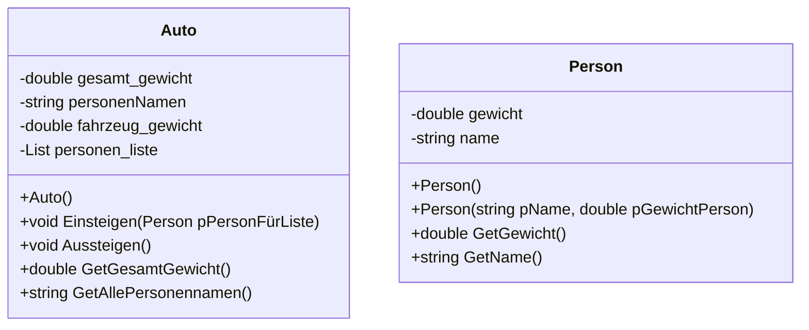

# Projekt Autogewicht (Luca, Timon, Jonas H.)

## Übersicht  
Dieses Programm simuliert das Ein- und Aussteigen von Personen in ein Auto und berechnet dabei das Gesamtgewicht des Autos. Das Programm ist in C# geschrieben und verwendet eine Windows Forms Oberfläche zur Interaktion mit dem Benutzer.

## Klassenbeschreibung

### Klassendiagramm

### Form1.cs
)  
*Oberfläche des Programmes aus C#*  

### Person.cs
Diese Klasse repräsentiert eine Person mit den Eigenschaften Namen und Gewicht.

**Variablen:**
- gewicht: _Das Gewicht der Person._
- name: _Der Name der Person._

**Konstruktoren:**
- Person(): _Standardkonstruktor, setzt den Namen auf "John Doe" und das Gewicht auf 100._
- Person(string pName, double pGewichtPerson): _Konstruktor mit Parametern, um den Namen und das Gewicht der Person zu setzen._

**Methoden:**
- GetGewicht(): _Gibt das Gewicht der Person zurück._
- GetName(): _Gibt den Namen der Person zurück._

### Auto.cs
Diese Klasse repräsentiert ein Auto, das Personen aufnehmen kann und das Gesamtgewicht berechnet.

**Variablen:**
- gesamt_gewicht: _Das aktuelle Gesamtgewicht des Autos inklusive Personen._
- personenNamen: _Eine Zeichenkette, die die Namen aller Personen im Auto enthält._
- fahrzeug_gewicht: _Das Grundgewicht des Autos ohne Personen._
- personen_liste: _Eine Liste von Personen, die sich im Auto befinden._

**Konstruktoren:**
- Auto(): _Standardkonstruktor, setzt das Fahrzeuggewicht auf 1000 und initialisiert das Gesamtgewicht auf das Fahrzeuggewicht._

**Methoden:**
- Einsteigen(Person pPersonFürListe): _Fügt eine Person zur Personenliste hinzu, welche bei der Methode übergeben wird (Variablentyp: Person)._
- Aussteigen(): _Leert die Personenliste._
- GetGesammtGewicht(): _Berechnet und gibt das Gesamtgewicht des Autos zurück._
- GetAllePersonennamen(): _Gibt die Namen aller Personen im Auto zurück._

## Verwendung
- Starten Sie das Programm.
- Geben Sie den Namen und das Gewicht einer Person in die entsprechenden Textfelder ein.
- Klicken Sie auf den Button "Speichern", um die Person hinzuzufügen.
- Klicken Sie auf den Button "Einsteigen", um das aktuelle Gewicht und die Namen aller Personen im Auto anzuzeigen.
- Klicken Sie auf den Button "Aussteigen", um alle Personen aus dem Auto zu entfernen und das Gewicht zurückzusetzen.

## Anmerkungen
Das Programm aktualisiert die Gewichtsanzeige und die Anzeige der Personennamen bei jeder relevanten Benutzeraktion.
Wenn Personen aussteigen, wird die Personenliste geleert und das Gewicht des Autos auf das Grundgewicht zurückgesetzt.
